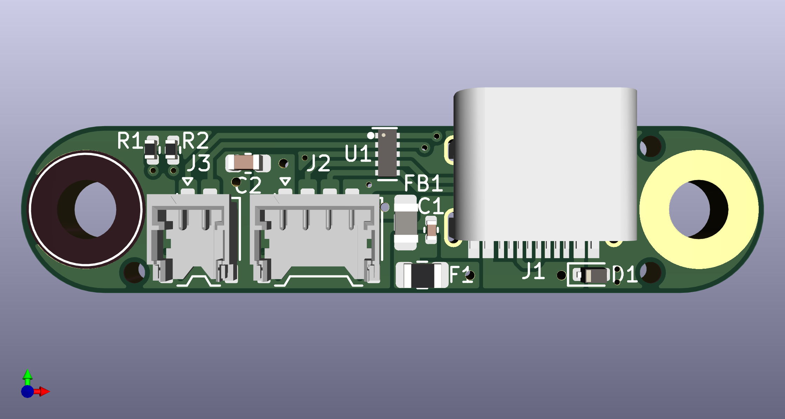
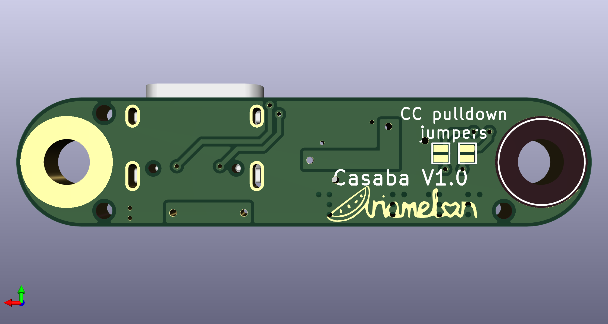

# Casaba
USB-C breakout board with integrated protection.

## Disclaimer
This board is a USB daughterboard to be used in custom mechanical keyboard projects, allowing the implementation of most electrical protection required in a keyboard via a tested, proven PCB. It also allows the replacement of the USB-C port in case it is damaged during use. The shape of the board and the positions of the M3 mounting holes and USB-C connector is based on the [Unified Daughterboard](https://unified-daughterboard.github.io/) [UDB-S](https://unified-daughterboard.github.io/#/db-spec-s), allowing for easy swap-in functionality.

## Key Features
* "Wide and narrow" 40mm wide x 9mm deep x 1.6mm thick form factor.
    - Avoids obstacles such as weights commonly found in custom keyboards.
    - Mountable both right-side-up and upside-down.
* 2 x M3 mounting points.
* Cheap to source via JLC assembly.
* Large DB corner radii which allow keyboard cases to be milled at a large inner radius.
* ESD protection, overcurrent protection, overvoltage protection, noise filtering, and single-point ground to chassis functionality.
* Breaks out CC pins in addition to USB pins.
* On-board solder jumpers allowing the user to connect 5k1 pull-downs to the CC pins if breaking them out is not required.

## Changelog
* 06/04/2023: Initial commit