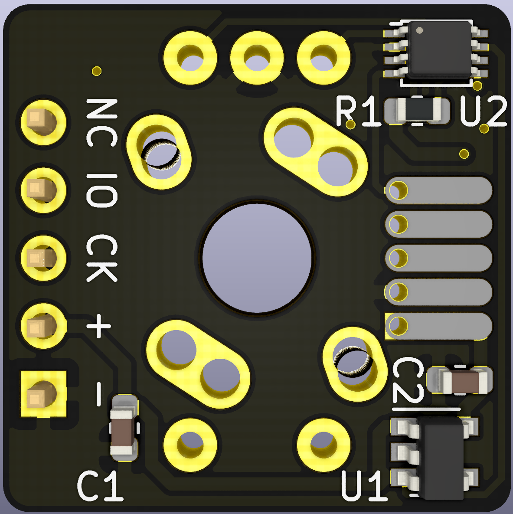

# Casaba
ADTB7M 1u Trackball Breakout

## Disclaimer
Just a breakout board for the BTO [ADTB7M](https://bit-trade-one.co.jp/selfmadekb/adtb7m/).

## Key Features
* Adapter board meant to fit either a normal keyswitch position or on a rotary encoder position.
* If soldered to the rotary encoder pads, it uses the rotary encoder A and B pins for the trackball module data and clock pins.
* On-board level shifter and voltage regulator.
* Breakout pins allow for direct soldering to the MCU if soldering to a normal switch position.

## Changelog
* 26/10/2020: Initial commit